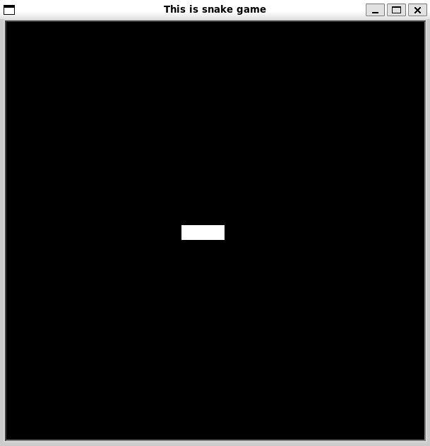
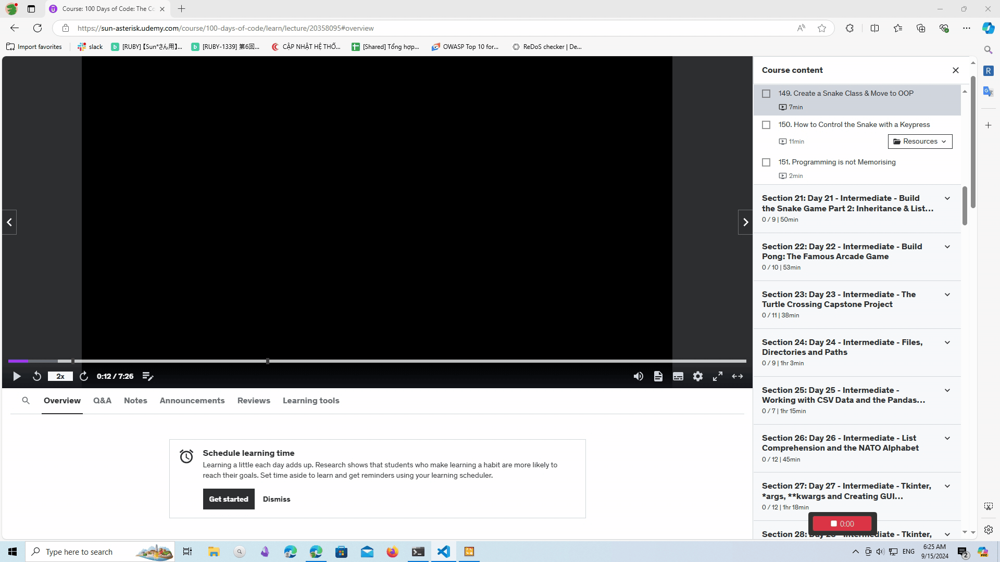

# Create start screen

```python
from turtle import Screen, Turtle

screen = Screen()
screen.setup(width=600, height=600, startx=0, starty=0)
screen.bgcolor("black")
screen.title("This is snake game")

start_points = [(0, 0), (-20, 0), (-40, 0)]

for point in start_points:
  new_segment = Turtle(shape="square")
  new_segment.color("white")
  new_segment.goto(point)

screen.exitonclick()
```



# Make snake move

```python
import time
from turtle import Screen, Turtle

screen = Screen()
screen.setup(width=600, height=600, startx=0, starty=0)
screen.bgcolor("black")
screen.title("This is snake game")

start_points = [(0, 0), (-20, 0), (-40, 0)]
segments = []
screen.tracer(0)

for point in start_points:
  new_segment = Turtle(shape="square")
  new_segment.color("white")
  new_segment.penup()
  new_segment.goto(point)
  segments.append(new_segment)

game_is_on = True
screen.update()

while game_is_on:
  screen.update()
  time.sleep(0.1)
  for seg_num in range(len(segments) - 1, 0, -1):
    new_x = segments[seg_num - 1].xcor()
    new_y = segments[seg_num - 1].ycor()
    segments[seg_num].goto(new_x, new_y)

  segments[0].forward(20)

screen.exitonclick()
```


